# Custom Dart Games

A mobile-first Spring Boot app to track scores for custom, self-invented dart games,
built to keep score during dart nights with my friends. Fully open source.

Keeps a catalog of game types and, per user, the best and worst score recorded for
each game type, a small persistent leaderboard. In-progress game session scores are
not persisted; only the resulting best/worst per (user, game) is saved once a game
finishes.

## Screenshots

| | | |
|---|---|---|
| 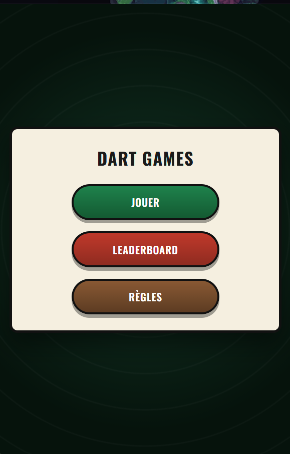 | 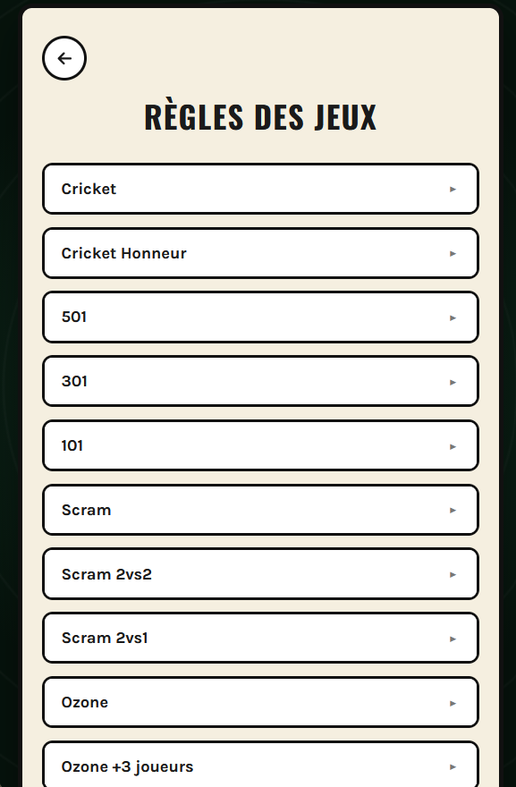 | 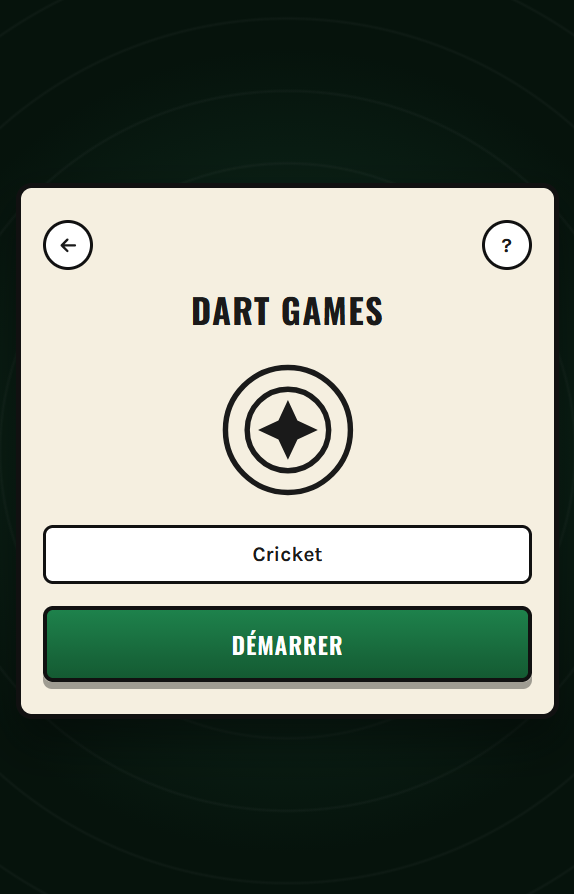 |
| 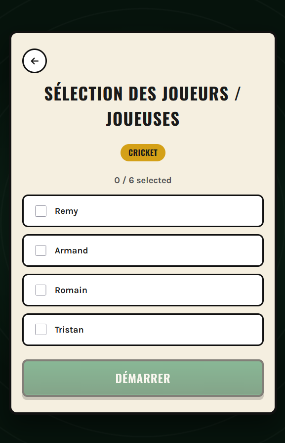 | 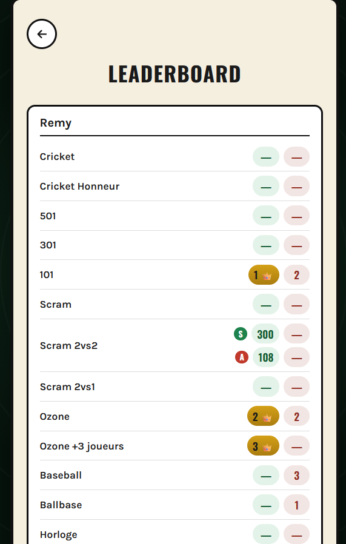 | 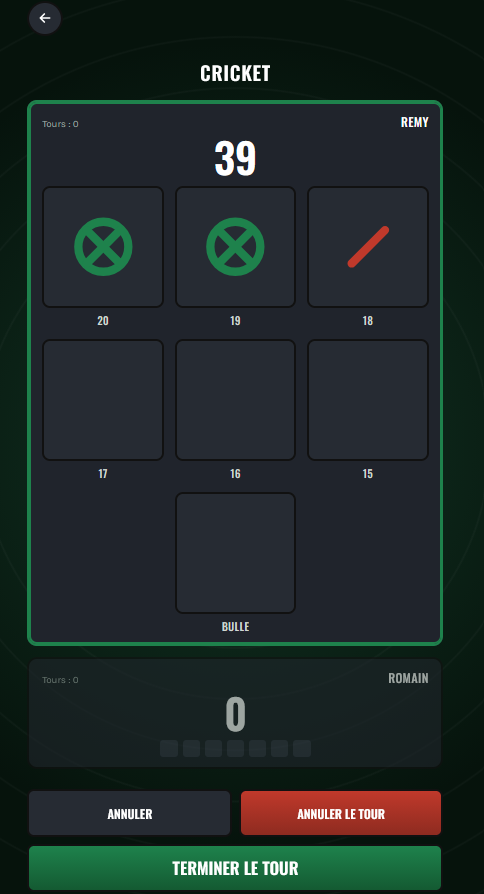 |
| 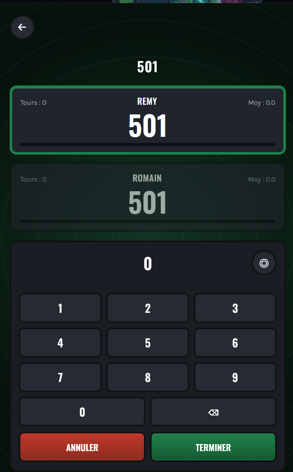 | 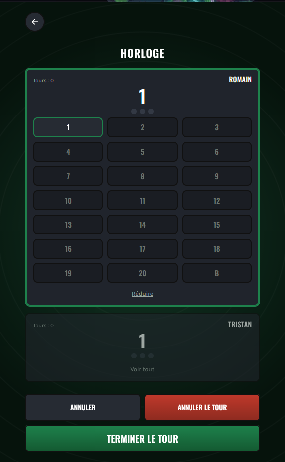 | 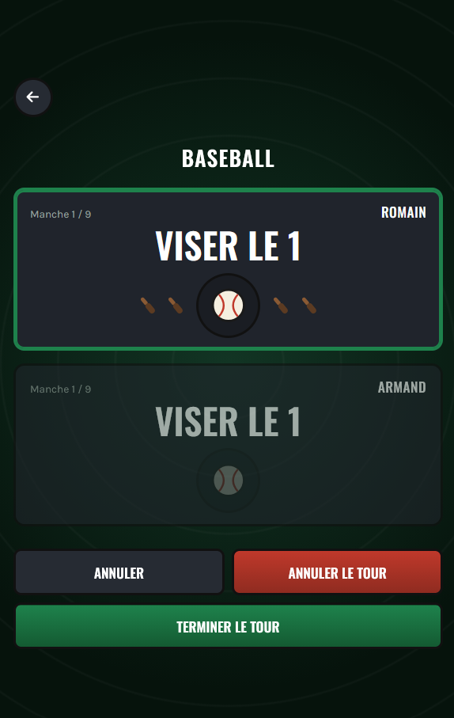 |
| 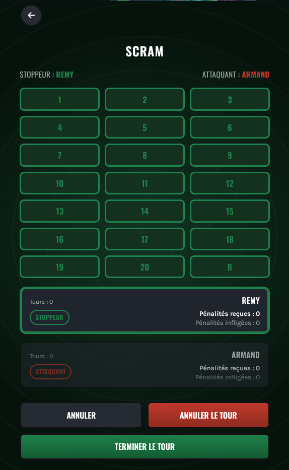 | 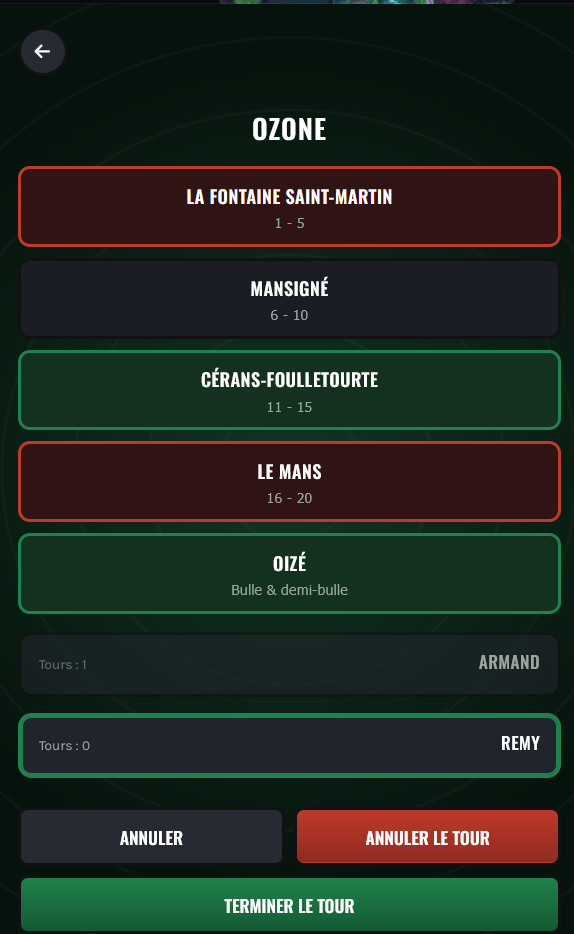 | 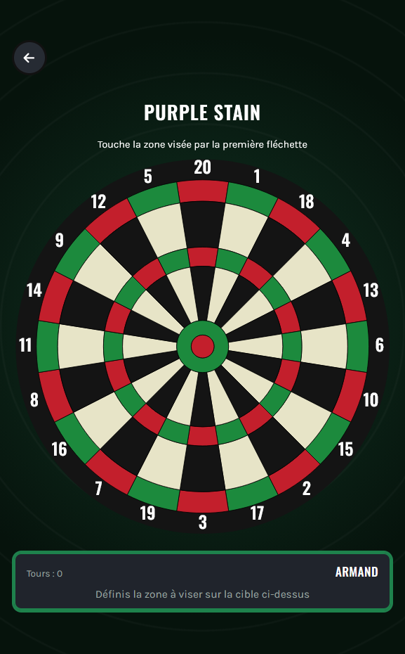 |
| 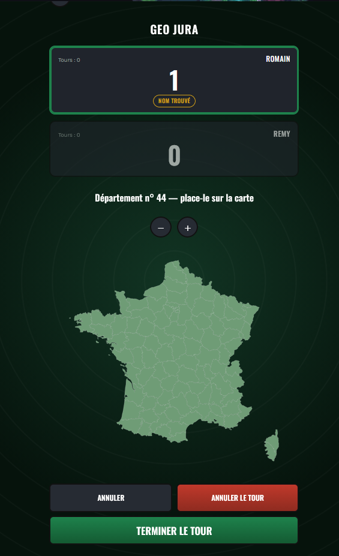 | | |

## How this project is built

This is a learning project as much as a scorekeeping app, and it's also my own test
of using Claude Code as my main frontend assistant: could I lean on it for the whole
Thymeleaf/CSS/JS side of a real app and stay purely on the Spring Boot side myself?
The split below exists specifically to answer that:

- **I write every line of Java myself**, controllers, JPA entities, repositories,
  the seeding logic, all of it. That's the part I'm actually here to get better at
  (Spring Boot, Spring Data JPA, Hibernate).
- **Claude Code builds the frontend**, Thymeleaf templates, CSS, and the vanilla JS
  that runs each game (turn order, undo, scoring rules, boards). No frontend
  framework, on purpose.

Nothing gets built without me driving it, every step, start to finish. I write out
the schema myself first, the rules of a game, the data shape, the screen flow I want,
and back it up with concrete examples I come up with on my own ("player A does X,
player B does Y, here's who should win and why") to pin down an edge case before any
code exists. Claude proposes an implementation from that, and I'm supervising it
constantly, not a one-time review at the end: I check every proposal, catch wrong
turn order, a rule read backwards, a UI element in the wrong place, and send it back
until it's right. Making it actually workable, not just plausible-looking, is the
whole reason I stay this involved.

For a rough sense of how much of the codebase is AI-assisted, by line count:

| | Lines | Written by |
|---|---:|---|
| Java (`src/main/java`) | ~1,100 | me, by hand |
| Templates + CSS + JS (`src/main/resources`) | ~6,250 | Claude Code, under review |

So frontend code is the majority of the codebase by volume, but every game's actual
*rules and behavior* came from me, Claude fills in the implementation in CSS, Thymeleaf and JavaScript vanilla, not the
design.

## Stack

- Java 17, Spring Boot 4
- Spring Data JPA / Hibernate
- MySQL 8.4
- Thymeleaf + vanilla JS (no frontend framework)

## Prerequisites

- JDK 17+
- Docker (for the MySQL database via Compose)

## Running locally

Start the database:

```bash
docker compose up
```

Then run the app:

```bash
./gradlew bootRun
```

The app listens on `http://localhost:8080`. Database connection settings are in
`src/main/resources/application.properties` and match the credentials defined in
`compose.yaml`, fine for local development, not meant for production use.

## Database schema

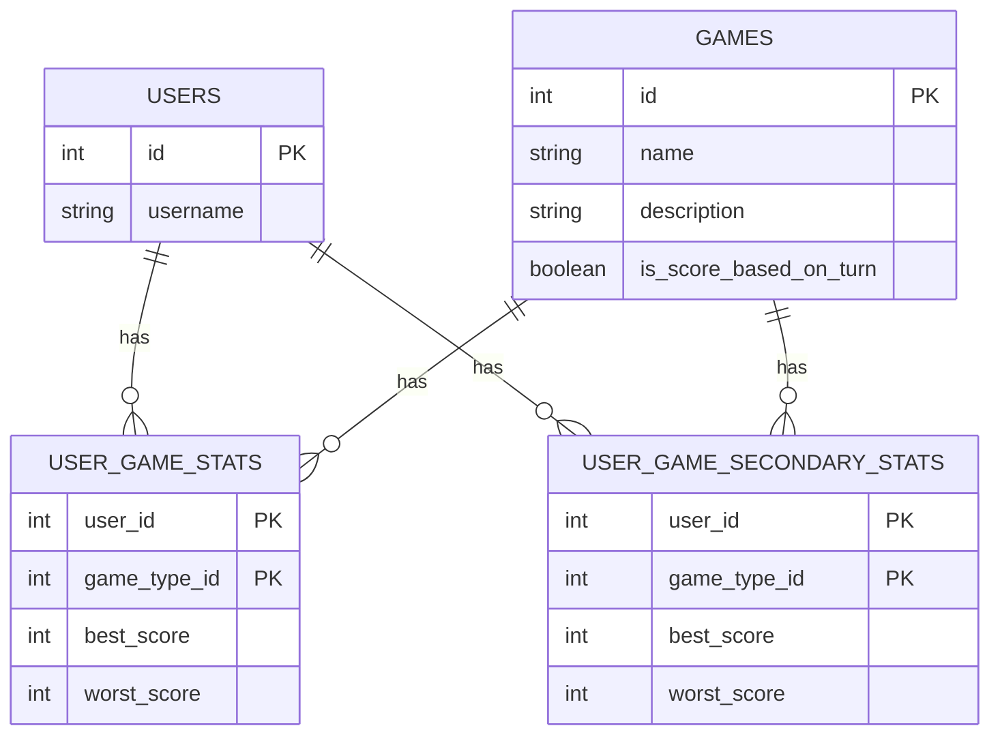

`user_game_stats` holds each player's primary score per game (the one shown on the
main leaderboard). `user_game_secondary_stats` shares the exact same composite-key
shape but tracks a second, independent metric for games that need one, e.g. Scram's
attacker "penalties inflicted" count, alongside the stopper's primary score. Both
tables use a composite primary key (`user_id`, `game_type_id`) via JPA's
`@EmbeddedId`/`@MapsId`, so a player has at most one row per game in each table.
Schema changes to the `@Entity` classes apply automatically on next boot
(`spring.jpa.hibernate.ddl-auto=update`), no manual migrations.

## Pages

- `GET /dart/`, home page.
- `GET /dart/rules`, accordion listing every game's rules.
- `GET /dart/players`, leaderboard: one row per player, one best/worst column pair per game type.
- `GET /dart/players/new`, form to add a player.
- `POST /dart/add`, creates a player (`username` form param), then redirects to `/dart/players`.
- `GET /dart/play`, pick a game to start.
- `POST /dart/play/start`, computes the required player count for the chosen game, redirects to player selection.
- `GET /dart/play/players-setup`, select which players are in, in play order.
- `POST /dart/play/start-game`, routes to the game's scoring screen. All 16 seeded games have one.
- `POST /dart/play/finish`, records the finished game's result in `UserGameStats` (and `UserGameSecondaryStats` when the game tracks one), then redirects to `/dart/play`.

16 game types are seeded automatically on first startup if the `games` table is empty:
Cricket, Cricket Honneur, 501, 301, 101, Scram, Scram 2vs2, Scram 2vs1, Ozone, Ozone +3
joueurs, Baseball, Ballbase, Horloge, Horloge Rapide, Geo Jura, Purple Stain, Killer.
Tables are created/updated automatically (`spring.jpa.hibernate.ddl-auto=update`).

## Project structure

- `MainController`, web endpoints (`/dart/...`); one `..._CODE` constant per seeded game, used to switch on game-specific behavior (player count, scoring screen).
- `model`, JPA entities: `User`, `Game`, `UserGameStats` / `UserGameSecondaryStats` (both keyed by the composite `UserGameStatsId`), and the `ScoreTrackable` interface they share.
- `repository`, Spring Data repositories: `UserRepository`, `GameRepository`, `UserGameStatsRepository`, `UserGameSecondaryStatsRepository`.
- `resources/templates`, one Thymeleaf view per game (`game-cricket`, `game-countdown`, `game-scram`, `game-ozone`, `game-baseball`, `game-clock`, `game-purple-stain`, `game-killer`, `game-geo-jura`), plus `home`, `rules`, `players`, `player-form`, `play`, `players-setup`. Games with multiple variants (Cricket, Scram, Ozone, Baseball, Clock) share one template, switched by a `variant` model attribute.
- `resources/static/js`, `game-turn-engine.js` (shared turn/undo engine used by most games) and `game-common.js` (shared exit-confirm modal + refresh-survival cleanup) underpin one script per game; `game-countdown.js` is the one game with its own hand-rolled turn logic instead of the shared engine.
- `resources/static/css`, single stylesheet, mobile-first (unprefixed rules are the small-screen baseline, `@media (min-width: 600px)` layers on larger screens).

There is no `src/test` directory yet, no test task to run.
